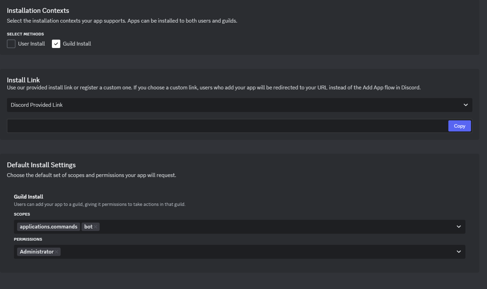

# Installation de EventBot 🛠️

Suivez les étapes ci-dessous pour installer et configurer le bot EventBot sur votre serveur Discord.

## Prérequis 📝

- **Node.js** version 16 ou supérieure. Vous pouvez télécharger la dernière version de Node.js ici : [Node.js](https://nodejs.org/)
- **Une base de données SQLite** pour stocker les événements.
- **Un serveur Discord** avec un bot ajouté.

## Étapes d'installation 🔧

### 1. Cloner le projet 📥

Clonez ce projet depuis GitHub sur votre machine locale :

```bash
git clone https://github.com/VOTRE_COMPTE/eventbot.git
cd eventbot 
```

### 2. Installer les Dependances 📥

Sur votre terminal collez ceci :

```bash
npm install discord.js sqlite3
```

### 3. Mettre le token Discord

Dans config.json vous devez mettre le token de votre application discord

Voici comment créer le bot et avoir le token :

<iframe width="1260" height="709" src="https://www.youtube.com/embed/u3QuKp0ZGBk" title="EventBot Config" frameborder="0" allow="accelerometer; autoplay; clipboard-write; encrypted-media; gyroscope; picture-in-picture; web-share" referrerpolicy="strict-origin-when-cross-origin" allowfullscreen></iframe>

### 4. L'inviter.

Il faut cocher Guild Install et en bas dans les scopes ajouter bot et en permissions Administrateur. Comme ici et ensuite copier le lien ! 



### 5. Le lancer.

Vous devez faire dans votre invité de commande 

```bash
node index.js
```

### 6. Les Commandes

Pour savoir les commandes il faut faire

!eventhelp

### Support 

Pour le support c'est soit sur ce serveur. 

[https://discord.gg/wztuKaWdSZ](https://discord.gg/wztuKaWdSZ)

Ou sur notre site 

[https://axelcorp.netlify.app/ticket](https://axelcorp.netlify.app/ticket)


### Fin. Merci

Fait avec ❤️